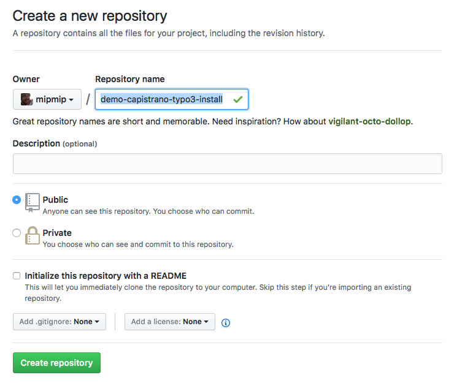

# Install TYPO3 from scratch with capistrano-typo3

## Introduction

In this tutorial we're going to install TYPO3 on two server locations. A
pre-live server and a staging server. The pre-live environment will
serve as our "live" environment where we presume all content is the
master content. In our git repository we will have 2 branches: staging and master.

When we deploy to staging it will use the staging-branch from git, and
when we deploy to pre-live it will use master.


## Create git project

To kick off our new project, we will create a new git project. For the
purpose of this tutorial, I'll create an new project at GitHub.



Now clone it and push it. So we have git project ready.

```
mkdir demo-capistrano-typo3-install
cd demo-capistrano-typo3-install
echo "# demo-capistrano-typo3-install" >> README.md
git init
git add README.md
git commit -m "first commit"
git remote add origin https://github.com/mipmip/demo-capistrano-typo3-install.git
git push -u origin master
```

## Install capistrano-typo3 with our installer

Next step is to use our installer.

curl -sSL https://raw.githubusercontent.com/Lingewoud/capistrano-typo3/master/install.sh | sh
